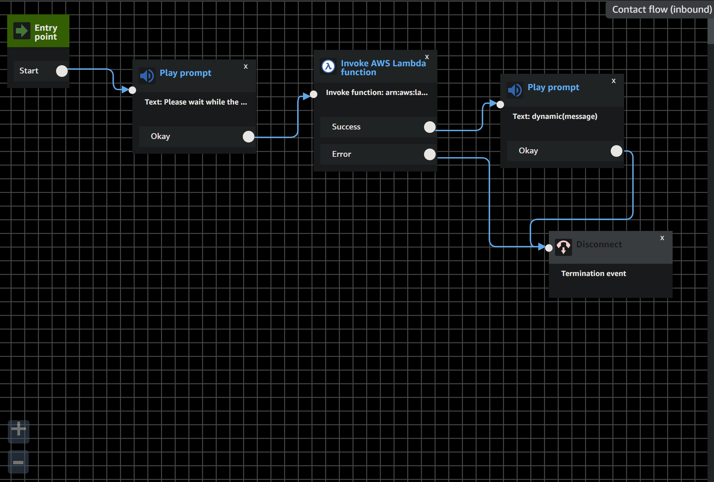

  &#xa0;

  <h1><a href="https://p615a15jae.execute-api.us-east-1.amazonaws.com/Prod/number?phoneNumber=18003569377">Click to test API with query string!</a></h1>

<h1 align="center">VoiceFoundry AWS Project</h1>

  

  

  

  <!--  -->

  <!--  -->

  <!--  -->

<!-- Status -->

<!-- <h4 align="center">
	🚧  voicefoundry-project 🚀 Under construction...  🚧
</h4>

 -->

  <a href="#dart-about">About</a> &#xa0; | &#xa0;
  <a href="#roadblocks">Roadblocks</a> &#xa0; | &#xa0;
  <a href="#rocket-technologies">Technologies</a> &#xa0; | &#xa0;
  <!-- <a href="#memo-license">License</a> &#xa0; | &#xa0; -->
  <a href="https://github.com/cort-robinson" target="_blank">Author - Cort Robinson</a> &#xa0; | &#xa0;

 

## :dart: About ##

This project was completed in a week as part of the VoiceFoundry hiring process. I had no prior experience with Amazon Web Services, so I'm sure many parts of the project could be configured much more securely.

Having no previous experience with AWS, I was able to learn the basics of the AWS platform and utilize it to deploy a fairly simple API which can return vanity numbers based off of a user-defined phone number.

The approach I used for the basic API was to use the AWS Lambda service to create a function which would be triggered by a GET request containing a queryString parameter to the API endpoint. The queryString parameter is then stripped of any non-numeric characters and evaluated to find words which can be spelt only to end the number. The function returns a list of words varying between three and seven characters in length. Once the numbers have been generated, they are returned to the user in a JSON format as well as saved along with the phone number used into a DynamoDB table.

The function also integrates into an Amazon Connect Contact Flow which sends the caller's number to the lambda and reads generated words back to the caller once the lambda has finished executing.

The Contact Flow integration has not been tested since I encountered a bug in Amazon Connect which prevented my account from being able to claim any phone numbers. Amazon's support pages stated that the issue would need to be manually resolved which could take up to a week.

The API endpoint, which can be accessed <a href="https://p615a15jae.execute-api.us-east-1.amazonaws.com/Prod/number?phoneNumber=18003569377">here</a>. To input a number, simply change the number at the end of the URL. If no number is given, the function will return a response stating so.

## Roadblocks ##

AWS ended up being more complicated than I had anticipated. The majority of my time was spent finding recources and learning about the AWS platform. I had to learn about the Lambda, DynamoDB, API Gateway, and Amazon Connect services.

After trying to navigate through the AWS platform blindly for a while to familiarize myself with its services, I started reading through the documentation. I started by reading through the SAM template model and the Lambda getting started guide. I ended up working my way through more recourses than I can remember. My poor computer ran through hours of my poor habit of leaving every tab open in case I needed to refer back to it.

Overrall, I learned a lot. In the past with my education I've developed and deployed most projects locally aside from a few in Netlify and Firebase. I learned that while definitely not as simple or user friendly as some other services out there, AWS is simply a powerhouse of a platform for developers if they take the time to learn it.

If I were to do this project again with more time, I would definitely purchase a course on AWS and learn more about the platform. While Amazon provides loads of documentation, finding the right resource pages for the specific thing your trying to do can be tedious. With more knowledge and experience with the platform, I would focus more on security as well as building more production-ready solutions. There were many times in which I saw multiple paths ahead and ended up going with the first one I could wrap my head around simply because of the time I had combined with my limited knowledge of the platform.

I want to thank the fine folks at VoiceFoundry for the opportunity to work through this project. Overrall I had a lot of fun with it and learned a lot. Sure there were several times I wanted to pull my hair out, but that's code, right?

## :rocket: Technologies ##

The following tools were used in this project:

- [AWS](https://aws.amazon.com/)
- [nodeJS](https://nodejs.org/en/)
- [is-word](https://www.npmjs.com/package/is-word)

## About the Author ##

Cort Robinson:
  Growing up in a military family, Cort has travelled all around the US. Throughout that time he developed a love and passion for technology and computer science. As a student at Holberton school of Computer Science, Cort has developed skills across a wide range of technologies and is always excited to expand his knowledge in to new areas.

Made with :heart: by <a href="https://github.com/cort-robinson" target="_blank">Cort Robinson</a>

* **Cort Robinson** - [GitHub](https://github.com/cort-robinson), [Twitter](https://twitter.com/cort_robinson), [LinkedIn](https://www.linkedin.com/in/cort-robinson-4201b41a9/)

&#xa0;

<a href="#top">Back to top</a>
